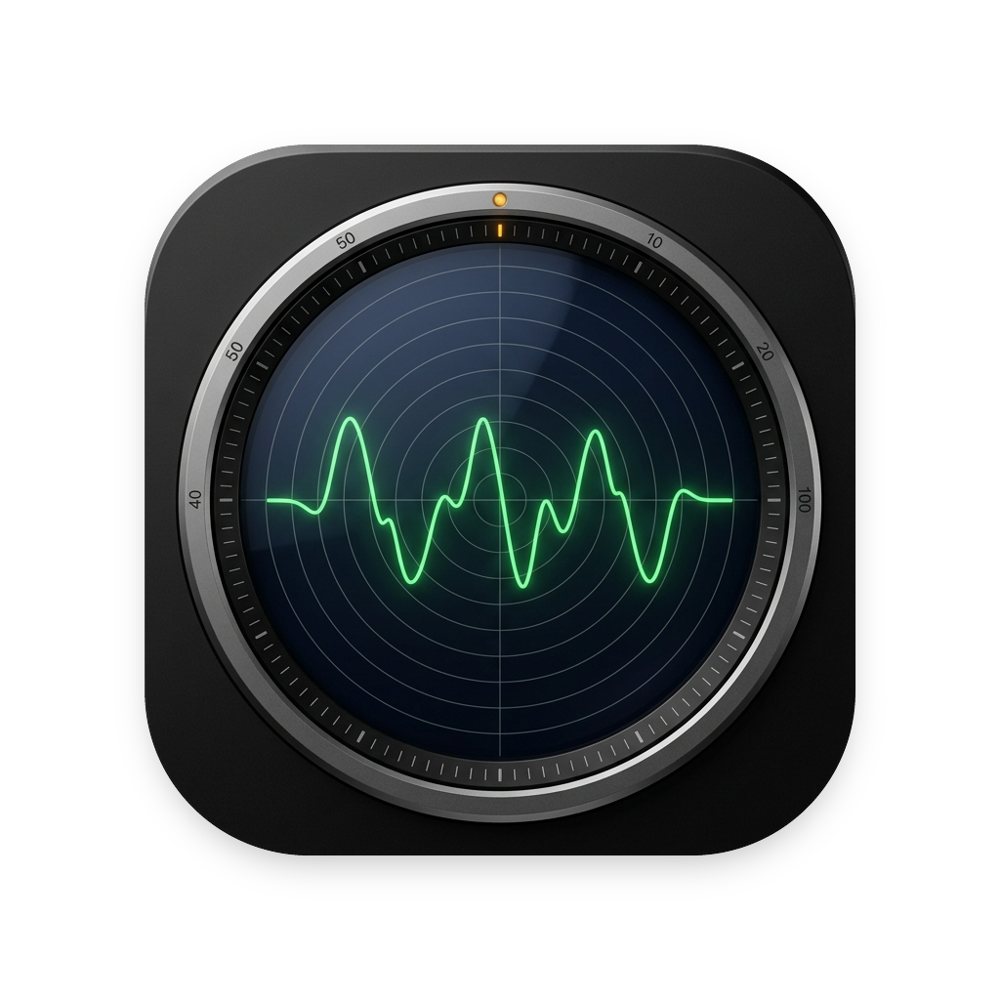
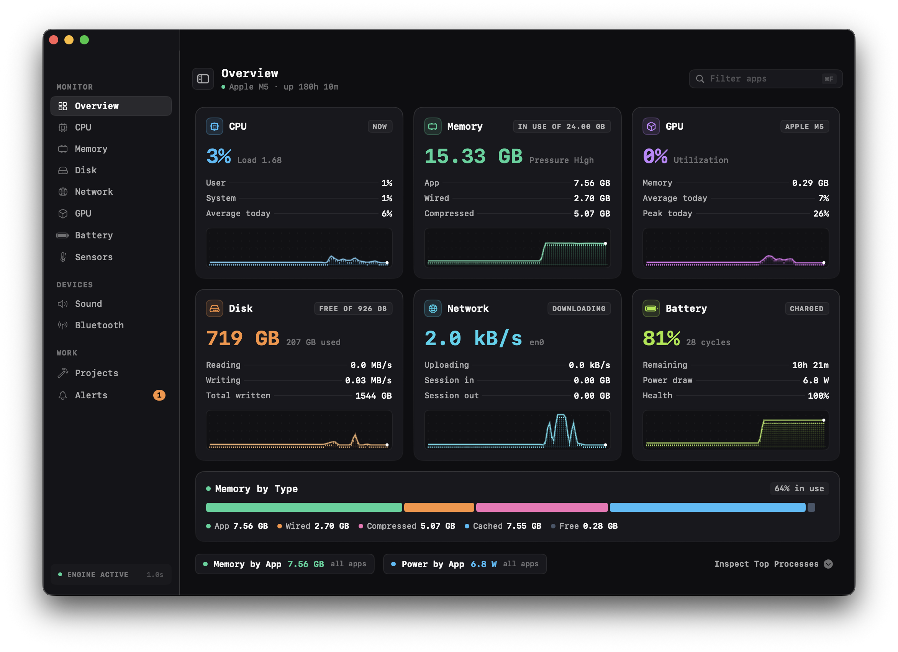
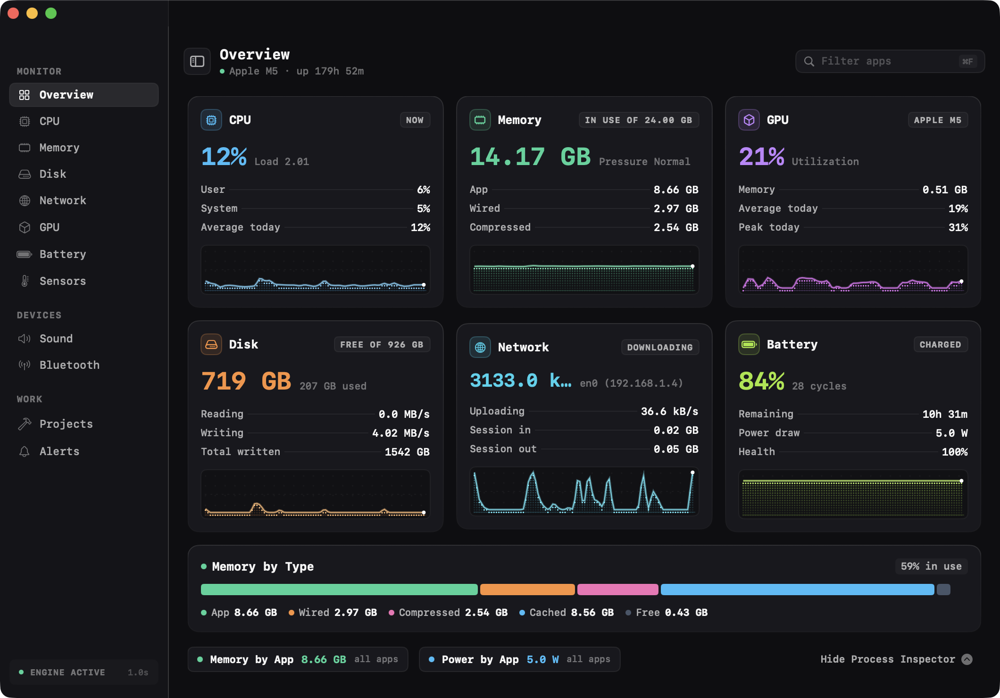
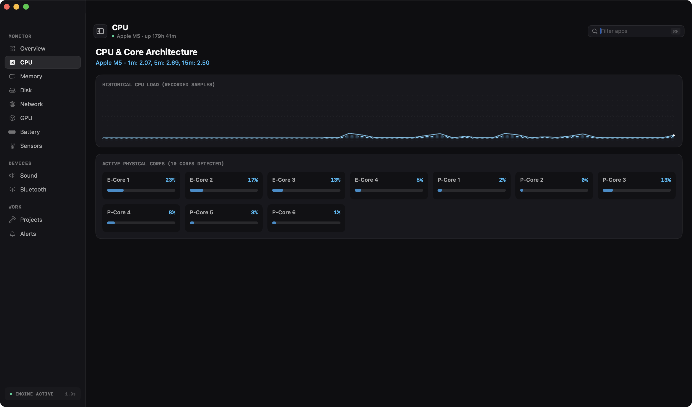

<div align="center">
  
  <h1>Spectra</h1>
  <p><strong>Boutique macOS Hardware Telemetry & System Monitor for Apple Silicon</strong></p>
  <p>Crafted in SwiftUI with pure Darwin kernel bindings, 60 FPS dot-matrix waveforms, and precision hardware industrial aesthetics.</p>
</div>

<p align="center">
  
</p>

---

## Highlights

- **100% Real Darwin Telemetry**: Zero mock data, zero simulated random numbers. Every value binds directly to Mach kernel, IOKit, Metal, and `libproc`.
- **Obsidian Hardware Aesthetics**: Inspired by precision lab instruments (Teenage Engineering, Elektron) and craft software (Linear, Raycast).
- **Universal Monospaced Typography**: Rendered in Apple SF Mono for mechanical clarity and numeric column stability.
- **Dynamic Responsive Engine**: Adapts across compact mini-HUDs (540x400), balanced studio layouts, and wide command centers (1440x880+) without card truncation.
- **Custom Dot-Matrix Waveforms**: Real-time phosphor radar graphs drawn with GPU-accelerated SwiftUI `Canvas` at 60 FPS.
- **Subsystem Breakdown**: In-depth inspection for CPU cores, GPU shader load, APFS volumes, network interfaces, battery health, and hardware thermal sensors.

---

## Interface Gallery

<div align="center">
  <table>
    <tr>
      <td width="50%">
        <p align="center"><strong>Process Inspector Drawer</strong></p>
        
      </td>
      <td width="50%">
        <p align="center"><strong>Per-Core CPU Telemetry</strong></p>
        
      </td>
    </tr>
  </table>
</div>

---

## 6 Core Subsystems

| Subsystem | Metric Sources | Telemetry Visuals |
| :--- | :--- | :--- |
| **CPU** (Cobalt Blue) | Mach `host_processor_info()` | User / System / Average load, per-core breakdown, load history matrix |
| **Memory** (Emerald Green) | Mach `vm_statistics64`, `host_statistics64()` | In-use GB, App, Wired, Compressed, Cached, and Free segmented bar |
| **GPU** (Amethyst Purple) | Metal `MTLCopyAllDevices()`, IOKit accelerator | Metal device name, shader utilization, allocated VRAM, daily peaks |
| **Disk** (Amber Orange) | POSIX `statfs()` | Total free / used space, read/write I/O throughput rates, total written |
| **Network** (Teal Cyan) | BSD `getifaddrs()` deltas | Live upload / download throughput (auto-scaling kB/s to MB/s), session totals |
| **Battery** (Electric Lime) | IOKit `AppleSmartBattery` & `IOPMPowerSource` | Charge percentage, cycle count, real capacity health, wattage draw |

---

## ⌨️ Keyboard Shortcuts

| Shortcut | Action |
| :--- | :--- |
| **⌘1** | Switch to Compact HUD preset (600 x 480) |
| **⌘2** | Switch to Studio Dashboard preset (1060 x 740) |
| **⌘3** | Switch to Command Center preset (1440 x 880) |
| **⌘B** | Toggle sidebar visibility |
| **⌘F** | Focus process search field |
| **⌘R** | Trigger manual telemetry sample refresh |

---

## 🚀 Quick Start

### Run from Command Line
```bash
# Build and run directly via Swift Package Manager
swift run

# Execute test suite
swift test
```

### Build & Package Local App
```bash
# Compile Release binary, sign ad-hoc, and create DMG + Zip
./bundle_app.sh

# Launch the app immediately
open Spectra.app

# Or install directly to /Applications
./bundle_app.sh --install
```

---

## 🛠️ System Architecture

- **UI Layer**: SwiftUI (macOS 14+ Sonoma & macOS 15+ Sequoia)
- **State Engine**: `@Observable` `AppState` with background actor polling loop at 1 Hz
- **Mach & POSIX Bindings**:
  - `host_processor_info()` for tick-level core utilization
  - `host_statistics64()` for unified memory page allocations
  - `libproc` (`proc_listpids`, `proc_pidinfo`) for live top resource consumers
  - `statfs()` for APFS container and volume capacities
  - `getifaddrs()` for active network interface byte counts
  - `IOServiceGetMatchingServices()` for Apple Smart Battery telemetry
  - `MTLCreateSystemDefaultDevice()` for Metal graphics engine inspection
